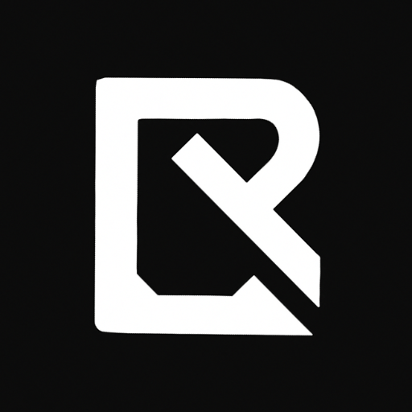
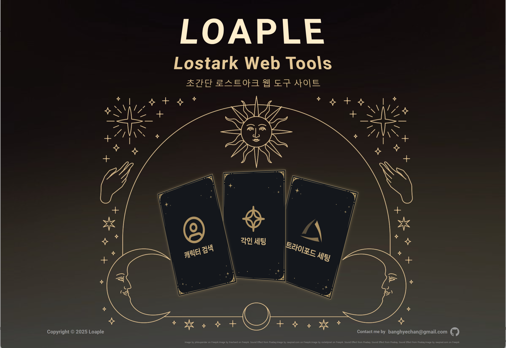
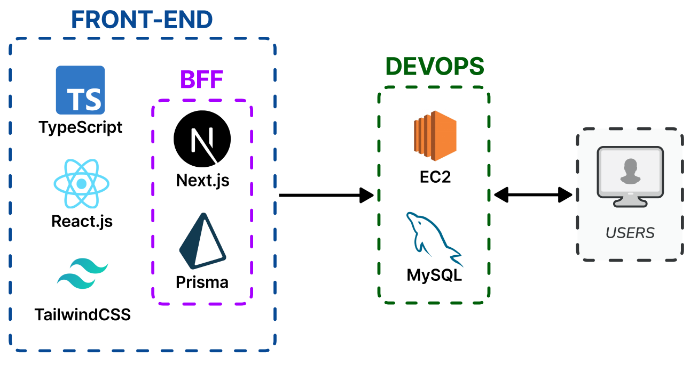

<a name="readme-top"></a>

<div align="center">
  

  <h3 align="center">로아플(LOAPLE)</h3>

  <p align="center">
    MMORPG 게임 로스트아크(LostArk) OpenAPI를 활용해, 불편한 인게임 검색 기능을 보완하고 유저 맞춤형으로 정보를 조회할 수 있는 서비스입니다.
    <br />
    
    <!-- <br />
    <a href="https://store-soljik.vercel.app/signin" >데모 사이트</a> -->
    <br />
    Contact : banghyechan@gmail.com
  </p>
</div>

<br />

---

<br />

## 프로젝트 소개

이 프로젝트는 LostArk 공식 OpenAPI 를 활용해 유저친화적인 서비스들을 제공하는 프로젝트입니다.

<br />

### 구현 기능(페이지 단위)

1. 캐릭터 검색 페이지
2. 각인 검색 페이지
3. 트라이포드 검색 페이지

<br />

---

<br />

## 프로젝트 아키텍처



<br />

---

## 프로젝트 폴더 구조

```
 /
 ├──📁 components   // 기능별로 코드를 세분화하여 컴포넌트로 저장합니다.
 ├──📁 container    // 이미지, 폰트 파일 등 프로젝트 내부에서 사용될 파일들을 저장합니다.
 ├──📁 contexts     // 이미지, 폰트 파일 등 프로젝트 내부에서 사용될 파일들을 저장합니다.
 ├──📁 data         // 페이지 내에서 사용될 데이터를 저장합니다.
 ├──📁 hooks        // 전역적으로 사용되는 커스텀 hook 들을 저장합니다.
 ├──📁 pages        // 라우팅과 페이지 컴포넌트를 관리합니다.
 ├──📁 prisma       // 각 페이지의 컴포넌트, 하위 컴포넌트 폴더를 저장하고 관리합니다.
 ├──📁 public       // 웹 애플리케이션에서 직접 접근 가능한 정적 리소스들을 저장합니다.
 ├──📁 service      // API 호출과 데이터 처리를 담당하는 서비스 로직을 정의합니다.
 ├──📁 styles       // 글로벌 스타일과 레이아웃 별 적용될 css 모듈들을 저장합니다.
 │   ├──📄 global.scss
 │   └──📄 *.module.scss
 ├──📁 types        // 타입 정의와 인터페이스를 관리합니다.
 ├──📁 web_workers  // 무거운 연산을 백그라운드에서 처리하는 웹 워커 스크립트를 관리합니다.
```

<br />

<p align="right">(<a href="#readme-top">back to top</a>)</p>
<br />

<!-- MARKDOWN LINKS & IMAGES -->
<!-- https://www.markdownguide.org/basic-syntax/#reference-style-links -->

[TypeScript]: https://img.shields.io/badge/TypeScript-20232A?style=for-the-badge&logo=typescript&logoColor=61DAFB
[TypeScript-url]: https://www.typescriptlang.org/
[React.js]: https://img.shields.io/badge/React-20232A?style=for-the-badge&logo=react&logoColor=61DAFB
[React-url]: https://reactjs.org/
[ReactQuery]: https://img.shields.io/badge/react_query-FFF3F4?style=for-the-badge&logo=reactquery&logoColor=FF4154
[ReactQuery-url]: https://tanstack.com/query/latest/docs/framework/react/overview
[ReactHookForm]: https://img.shields.io/badge/react_hook_form-EC5990?style=for-the-badge&logo=reacthookform&logoColor=FFFFFF
[ReactHookForm-url]: https://react-hook-form.com/
[StyledComponent]: https://img.shields.io/badge/styled--components-FFF1FA?style=for-the-badge&logo=styledcomponents&logoColor=E871BF
[StyledComponent-url]: https://styled-components.com/
[Firebase]: https://img.shields.io/badge/firebase-FFC400?style=for-the-badge&logo=firebase&logoColor=E871BF
[Firebase-url]: https://firebase.google.com/
[Vite]: https://img.shields.io/badge/vite-B53EFE?style=for-the-badge&logo=vite&logoColor=FFCF27
[Vite-url]: https://ko.vitejs.dev/guide/
[Github]: https://img.shields.io/badge/github-FAFAFA?style=for-the-badge&logo=github&logoColor=000000
[Github-url]: https://docs.github.com/ko/actions
[GithubActions]: https://img.shields.io/badge/github_actions-F4F9FF?style=for-the-badge&logo=githubactions&logoColor=2088FF
[GithubActions-url]: https://docs.github.com/ko/actions
[Vercel]: https://img.shields.io/badge/Vercel-000000?style=for-the-badge&logo=vercel&logoColor=FFFFFF
[Vercel-url]: https://vercel.com/
